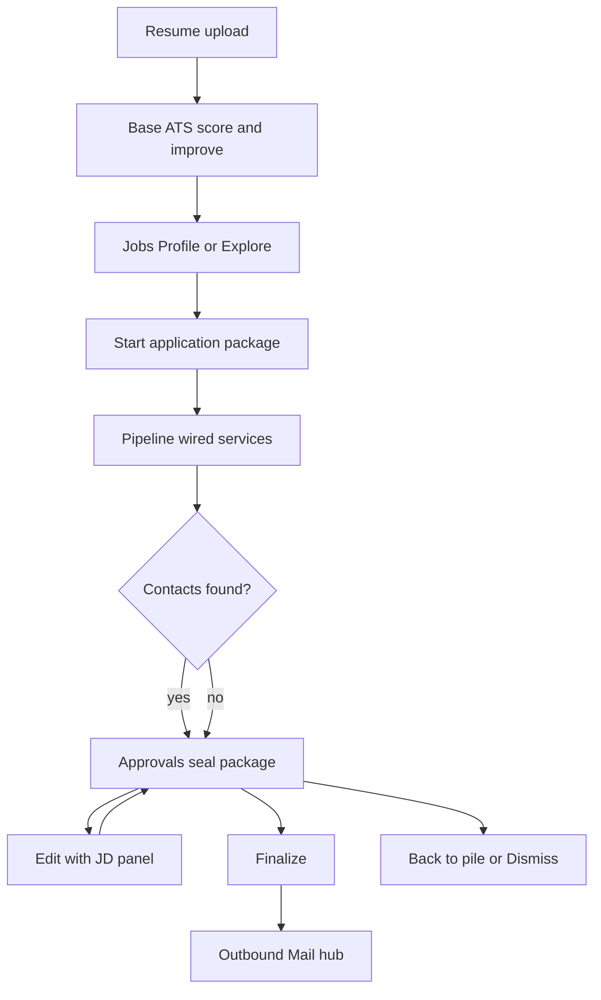

# Application Package, ATS Resume & Outbound Mail — Design

**Date:** 2026-09-25  
**Status:** Approved in brainstorming (Approach 1: wire-first)  
**Codebase:** career-agent

## Problem

Pipeline approval packages currently surface weak stub drafts, thin edit UX (no JD side-by-side), no discard-from-pipeline paths, no per-job ATS resume customization in the seal flow, and no outbound mail hub with artifact history/TTL. Contact-finding can return zero people with no equal CTAs. Jobs discovery does not separate vague browse from preference-precise search.

## Goals

- One **Application Package** in Approvals: hook email + apply materials + customized ATS resume (score visible) + JD for editing.
- Persuasive contact outreach (hook subject) without inventing facts or email addresses.
- Base-resume ATS gate + per-job refine toward **≥ 90**, with credit warning for low base scores.
- Equal no-contact CTAs: apply via job link | scrape thoroughly again.
- Soft discard: back to pile | dismiss (no hard-delete in this phase).
- Outbound mail dashboard + history; mailbox connect stub; artifact TTL.
- Jobs: **For your profile** vs **Explore**.

## Non-goals (this phase)

- Full inbound Gmail/Outlook mailbox.
- Hard-delete / GDPR purge workflows.
- Auto-marking applications SUBMITTED without evidence.
- Inventing experience, skills, metrics, or email addresses.

## Locked decisions

| Topic | Choice |
|-------|--------|
| Seal package | Contact email **and** apply materials together |
| No contacts | Equal CTAs (third-party apply + deep scrape) |
| ATS resume | Upload gate + short per-job loop; warn if base &lt; 90 (more credits later) |
| Discard | Soft only: back to pile + dismiss |
| Mail | Outbound hub now; connect-mailbox stub; inbound later |
| Expiry | Unsent 72h; after applied, unsent drafts/resumes 24h; sent kept until user deletes |
| Architecture | Wire-first: inject existing domain services into career pipeline |

## Architecture (wire-first)

### Domain wiring

Inject into [`CareerWorkflowService`](packages/domain/career_workflow.py) (API + workers):

- `content` → [`ApplicationContentService`](packages/domain/application_content.py) (cover / materials; fact-checked).
- `resume` → [`ResumeCustomizationService`](packages/domain/resume_customization.py) + new **ATS scorer** (JD keyword coverage, 0–100) with capped iteration (≤3) toward ≥90.
- `outreach_draft` → [`OutreachService`](packages/domain/outreach.py) using recruiter/HM prompt kinds with **hook subject** generation.
- `people` → already wired to people research; empty result triggers no-contact package UI (not a pipeline failure).

Persist package snapshot on application `submission_evidence` / linked outreach + resume_version ids: hook subject/body, ats_score, keyword gaps, contact ids, `expires_at`.

### ATS scoring

- New focused service (e.g. `AtsScoreService`): extract JD keywords/skills; score resume plain text / structured fields; return score + matched/missing lists.
- Never adds fake skills to raise score; customization may only reorder/emphasize existing facts ([`resume_validation`](packages/domain/resume_validation.py)).
- Base score: against profile target roles / aggregated preference keywords when no single JD.
- Per-job score: against that job’s description.
- UI shows score ring + gaps; credit copy when base &lt; 90.

## UI flows

### Approvals — seal package (§1)

One accordion row per pending application package:

- JD (full or long snippet)
- Hook subject + email body
- Customized resume preview + ATS score
- Contacts **or** equal buttons: Apply via job link | Scrape thoroughly again
- Primary: **Finalize this package**
- Secondary: **Edit** (JD + email + resume)
- Soft: **Back to pile** | **Dismiss**

Dumb next-step copy: “Check the email and resume score, then Finalize — or Edit with the JD open.”

### Edit page

Extend [`/applications/[id]/edit`](apps/web/src/app/applications/[id]/edit/page.tsx): JD panel + email fields + resume/ATS; refine prompts cannot invent facts.

### Resumes — base gate (§2)

On upload / Resumes: run base ATS; allow continue below 90 with persistent warning about future credit cost; CTA to improve base first.

### Mail hub (§4)

Upgrade outreach experience to outbound **Mail** hub: draft / approved / sent; open package; send with resume attachment when provider supports it (mock/live via provider interface). Settings: Connect mailbox — coming soon.

### Jobs — Opportunities split (§4)

- **For your profile** — preference-driven discovery (precise).
- **Explore** — broader/vague browse; UI explains lower precision.

### Discard (§4)

- **Back to pile:** withdraw application; cancel open approval tasks; stop/cancel pipeline run; match → `new` (or `saved` if appropriate); leave discovery pool.
- **Dismiss:** match → `dismissed`; withdraw application; same task cleanup.

## Data & expiry

| Artifact | TTL |
|----------|-----|
| Unsent email drafts, draft materials, customized resume versions for a package | 72 hours from creation/last meaningful update |
| Same unsent artifacts after application applied/submitted | Purge 24 hours after applied/submitted |
| Sent outreach records | Keep until user deletes |

Worker/cron: expire unsent artifacts; never auto-delete sent mail in this phase.

## Error handling & honesty

- No invented emails, employers, dates, metrics, or skills.
- External apply does not set SUBMITTED without evidence (user may record “applied externally” as a note/task evidence path, not silent SUBMITTED).
- People/research soft-fail → empty contacts + CTAs, not pipeline crash.
- ATS loop stops at cap with honest &lt;90 score in Approvals.

## Testing

- Pipeline uses real content/resume/outreach injectors (or integration with mocks); stubs not default in API construction.
- ATS score monotonicity / no fabrication under customize.
- Approvals package shows JD + score; no-contact CTAs present when empty.
- Back to pile restores match to discovery; dismiss hides from New/All.
- Expiry job removes unsent after 72h; applied path 24h; sent preserved.
- Mail hub lists draft→sent transitions; refine/edit keeps JD context.

## Out of scope follow-ups

- Inbound mailbox OAuth and reply-driven follow-up cancel.
- Hard-delete / archive purge.
- Billing meter implementation details for “more credits” (surface warning copy; wire to usage when billing exists).

## Success criteria

User starts a job from Profile or Explore → package pauses at Approvals with persuasive hook email, JD-visible edit, ATS score aiming ≥90, contacts or equal CTAs → Finalize or soft discard → outbound Mail shows history; unsent junk expires; sent remains.
